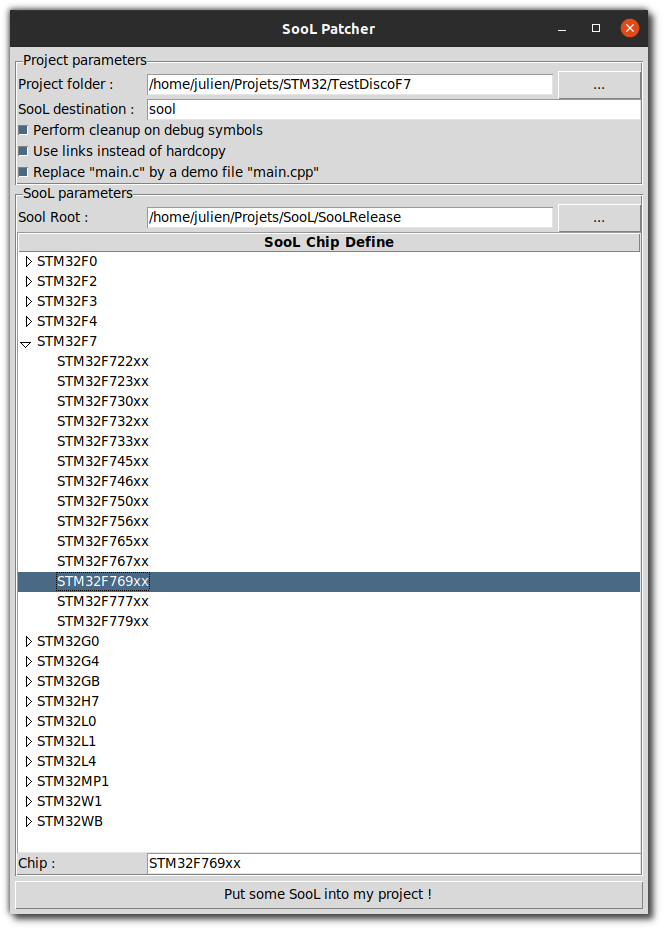

# Cube IDE project patcher

Project patcher for CubeIDE project 



## Project patcher setup

Clone the master branch of this repository wherever you like. To use the tool, execute `gui_cube_patcher.py` using 
Python 3.

## HOWTO :

First, create a project in STM32CubeIDE using `New STM32 Project`, **select the right STM32 target**, use the options :

- Targeted Language : C++
- Targeted Binary Type : Executable
- Targeted Project Type : **Empty**

And hit "Finish".

Get yourself a SooL release with a manifest and put it in any directory, let say `/path/to/sool`.
You should have the `core` folder at `/path/to/sool/core` and a `manifest.xml` file at `/path/to/sool/manifest.xml`.

Then launch the Project patcher tool using Python3 and executing the `gui_cube_patcher.py` file.

> The `cube_patcher.py` is intended for command line interface but is not implemented as of now and won't work as 
> expected.

Provide your project root folder (it should contains a `.cproject` file) and specify a relative root folder for sool in your project.
In example use `drivers/sool`. This folder should not exist and will contain SooL's `core` folder.

Select the sool root directory (`/path/to/sool`), a list of chip defines should appear.
Select your SooL chip define, matching your chip. You can also write it directly in the "Chip" field.

Then `Put some SooL into my project` !

Finally hit F5 or `File > Refresh` while selecting your project in STM32CubeIDE and all new files should appear in CubeIDE.

## Workarounds

### No manifest for SooL

As of today, the release of SooL does not contains a manifest.
You should take the one generated by the builder script (in the `out/` folder) and simply paste it into your SooL directory.
At the end, the SooL folder should look like this :

```
sool
    ├── core
    │   ├── include
    │   │   ├── lib_utils
    │   │   │   └── ...
    │   │   └── ...
    │   ├── sool_chip_setup.h
    │   ├── sool_setup.h
    │   ├── src
    │   │   └── ...
    │   └── system
    │       ├── cmsis
    │       │   └── ...
    │       ├── include
    │       │   └── ...
    │       └── src
    │           └── ...
    └── manifest.xml
```

Right now, the only information extracted from the manifest is the list of supported chips.